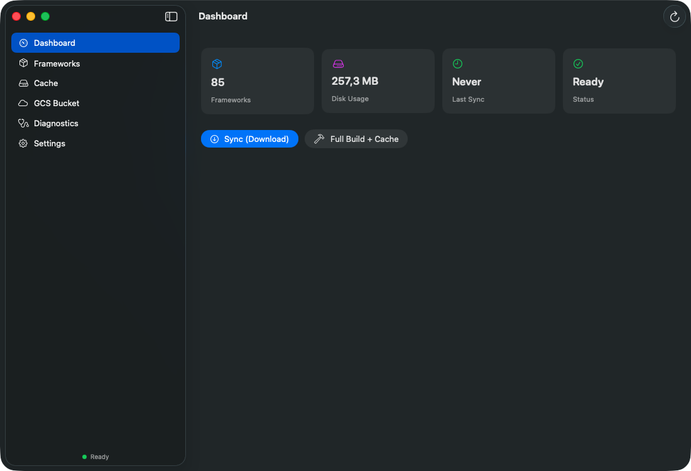
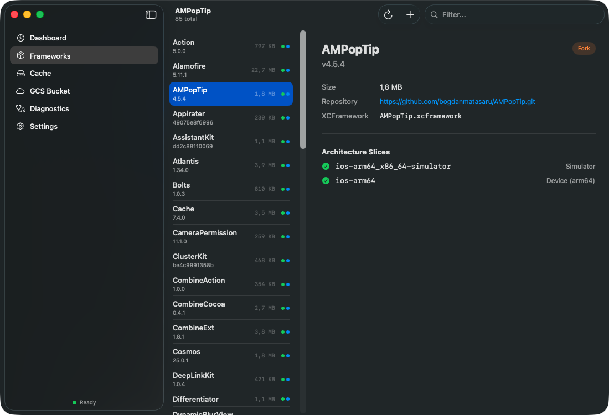
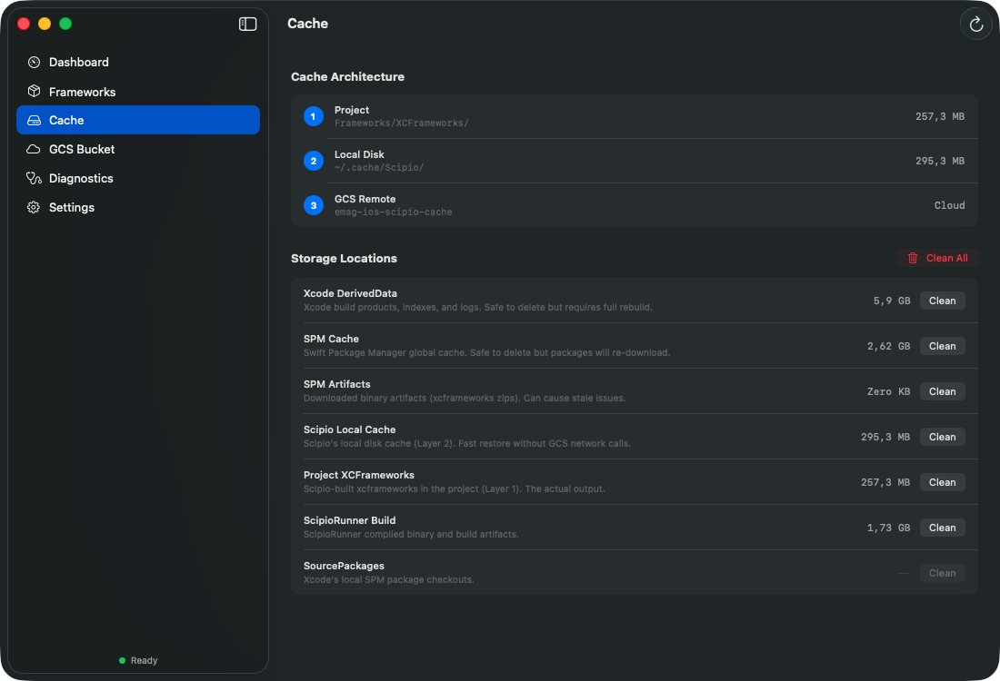
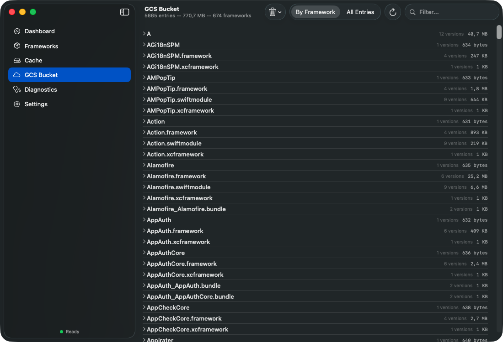
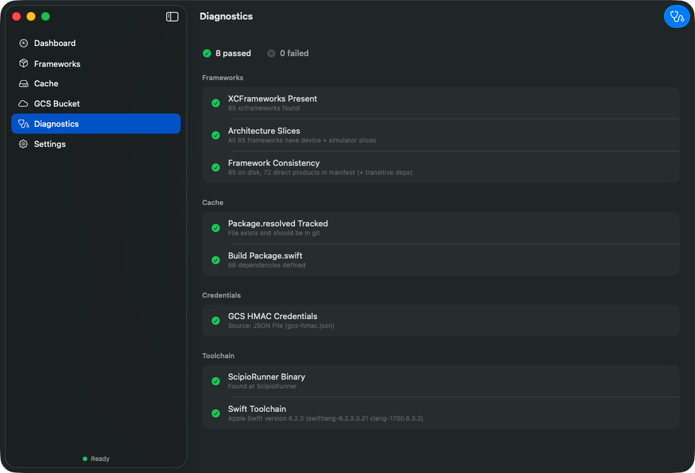
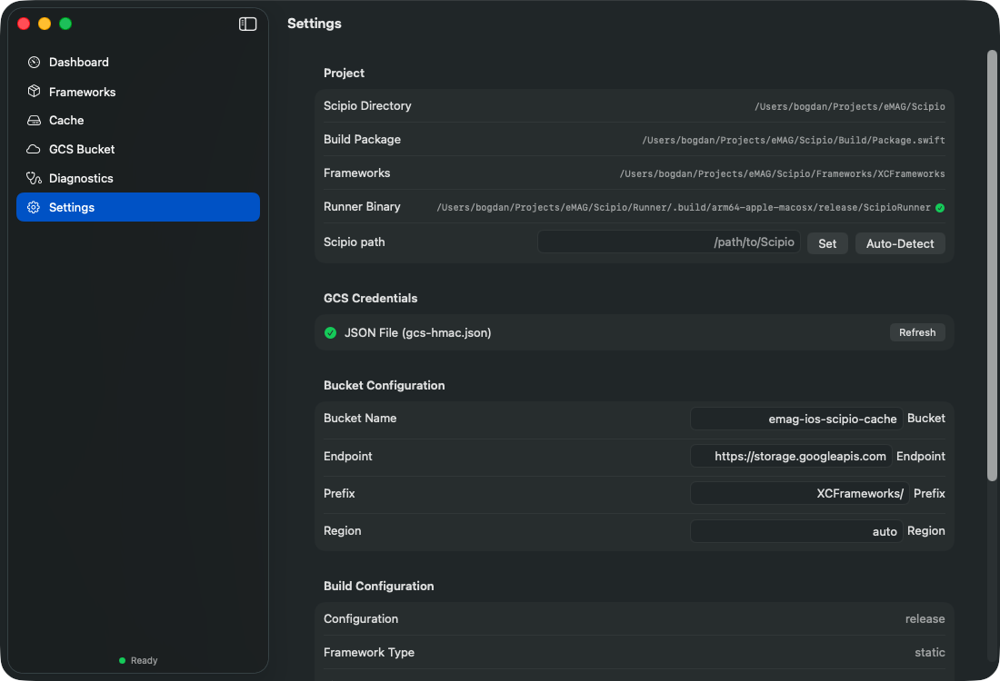

<p align="center">
  
</p>

<h1 align="center">Scipio Manager</h1>

<p align="center">
  <em>"Carthago delenda est"</em> — Cato the Elder
</p>

<p align="center">
  A native macOS app for managing <a href="https://github.com/giginet/scipio">Scipio</a> XCFramework caches.<br>
  Built with SwiftUI for iOS teams that pre-build Swift Package dependencies.
</p>

<p align="center">
  
  
  
  
  
</p>

---

## Why Scipio Manager?

If you use [Scipio](https://github.com/giginet/scipio) to pre-build your Swift Package dependencies as XCFrameworks, you know the pain:

- **"How big is my cache?"** — No easy way to check without `du -sh` in terminal
- **"Are all slices present?"** — Missing arm64 slice? You'll find out at build time
- **"What's in the remote bucket?"** — Navigating GCS console is slow and noisy
- **"Clean everything and rebuild"** — Multiple manual `rm -rf` commands across 7+ locations
- **"Is my setup healthy?"** — Checking credentials, toolchain, Package.swift one by one

**Scipio Manager replaces all of that with a single, elegant macOS app.**

> **The Name**: Just as [Scipio Africanus](https://en.wikipedia.org/wiki/Scipio_Africanus) conquered [Carthage](https://en.wikipedia.org/wiki/Carthage) in the Punic Wars, the [Scipio](https://github.com/giginet/scipio) build tool is the modern successor to [Carthage](https://github.com/Carthage/Carthage) — and Scipio Manager gives you full command over it.

---

## Screenshots

<table>
  <tr>
    <td align="center"><strong>Dashboard</strong></td>
    <td align="center"><strong>Frameworks</strong></td>
  </tr>
  <tr>
    <td></td>
    <td></td>
  </tr>
  <tr>
    <td align="center"><strong>Cache Management</strong></td>
    <td align="center"><strong>GCS Bucket Browser</strong></td>
  </tr>
  <tr>
    <td></td>
    <td></td>
  </tr>
  <tr>
    <td align="center"><strong>Diagnostics</strong></td>
    <td align="center"><strong>Settings</strong></td>
  </tr>
  <tr>
    <td></td>
    <td></td>
  </tr>
</table>

---

## Features

### Dashboard — Everything at a glance
One screen shows your **framework count**, **disk usage**, **last sync time**, and **status**. Two action buttons let you:
- **Sync (Download)** — Pull pre-built frameworks from GCS (fast, for consumers)
- **Full Build + Cache** — Build all frameworks locally and upload to GCS

A live console shows real-time output from ScipioRunner.

### Frameworks — Browse every dependency
See all XCFrameworks in your project with:
- **Version** and **size** for each framework
- **Architecture slices** (Simulator, Device) with status indicators
- **Repository URL** and XCFramework file name
- **Fork badge** — highlights frameworks from your organization's forks
- **Filter** to quickly find any framework by name

### Cache — Understand your 3-layer architecture
Scipio uses a 3-tier cache:

| Layer | Location | Purpose |
|:------|:---------|:--------|
| **1. Project** | `Frameworks/XCFrameworks/` | Active XCFrameworks used by Xcode |
| **2. Local Disk** | `~/.cache/Scipio/` | Fast local restore without network |
| **3. GCS Remote** | Your cloud bucket | Shared team cache for CI/CD |

Scipio Manager visualizes each layer with its size, and provides **individual cleanup** buttons plus a **"Clean All"** nuclear option. Additional storage locations shown:
- Xcode DerivedData, SPM Cache, SPM Artifacts, ScipioRunner Build, SourcePackages

### GCS Bucket Browser — Full control over remote cache
Browse your Google Cloud Storage bucket with:
- **By Framework** grouping — see versions and sizes per framework
- **All Entries** flat table — every object in the bucket
- **Filter** to search across entries
- **Bulk delete** — select and remove entries
- **Stats** — total entries, total size, framework count

### Diagnostics — Instant health check
One-click scan that verifies 8 checks across 4 categories:

| Category | Checks |
|:---------|:-------|
| **Frameworks** | XCFrameworks present, Architecture slices complete, Framework consistency |
| **Cache** | Package.resolved tracked in git, Build Package.swift valid |
| **Credentials** | GCS HMAC credentials available and valid |
| **Toolchain** | ScipioRunner binary found, Swift toolchain version |

### Settings — Full configuration visibility
View and adjust:
- Scipio directory path (manual or auto-detect)
- DerivedData prefix (auto-detected from `.xcworkspace`/`.xcodeproj`)
- GCS credentials status
- Bucket configuration (name, endpoint, prefix, region)
- Build configuration (release/debug, static/dynamic)
- Config file location

---

## Quick Start

### 1. Install

**Download** the latest signed `.app` from [Releases](../../releases), or build from source:

```bash
git clone https://github.com/bogdanmatasaru/ScipioManager.git
cd ScipioManager
./scripts/build-app.sh
```

The build script creates a signed universal binary (arm64 + x86_64) `.app` bundle. See [Building a `.app` Bundle](#building-a-app-bundle) for details.

### 2. Configure

Create a `scipio-manager.json` file next to the `.app` bundle. **Only `bucket.name` is required** — everything else is auto-detected:

```json
{
  "bucket": {
    "name": "your-bucket-name"
  }
}
```

<details>
<summary>Full config with all options (all optional except <code>bucket.name</code>)</summary>

```json
{
  "scipio_path": "/Users/you/Projects/MyApp/Scipio",
  "bucket": {
    "name": "your-bucket-name",
    "endpoint": "https://storage.googleapis.com",
    "storage_prefix": "XCFrameworks/",
    "region": "auto"
  },
  "hmac_key_filename": "gcs-hmac.json",
  "derived_data_prefix": "MyApp-",
  "fork_organizations": ["your-org"]
}
```
</details>

### 3. Launch

Double-click `ScipioManager.app`. The Dashboard loads automatically with your project stats.

---

## Configuration Reference

Scipio Manager searches for `scipio-manager.json` in this order:

1. **Next to the `.app` bundle** (recommended for project-specific setups)
2. **Current working directory** (useful when launching from terminal)
3. **`~/.config/scipio-manager/config.json`** (global fallback)

### Fields

| Field | Type | Required | Description |
|:------|:-----|:---------|:------------|
| `scipio_path` | `String` | No | Absolute path to your Scipio directory. Auto-detected from app location if omitted. |
| `bucket.name` | `String` | Yes | GCS/S3-compatible bucket name |
| `bucket.endpoint` | `String` | No | Storage endpoint URL. Default: `https://storage.googleapis.com` |
| `bucket.storage_prefix` | `String` | No | Object key prefix in the bucket. Default: `XCFrameworks/` |
| `bucket.region` | `String` | No | Bucket region. Default: `auto` |
| `hmac_key_filename` | `String` | No | Name of the HMAC JSON credential file in your Scipio directory. Default: `gcs-hmac.json` |
| `derived_data_prefix` | `String` | No | Override for DerivedData folder prefix (e.g., `MyApp-`). **Auto-detected** from your `.xcworkspace` or `.xcodeproj` name. Only needed if auto-detection picks the wrong project. |
| `fork_organizations` | `[String]` | No | GitHub usernames/orgs — dependencies from these repos get a "Fork" badge in the Frameworks view. |

### HMAC Credentials

For GCS remote cache features, place a JSON file (named per `hmac_key_filename`) in your Scipio directory:

```json
{
  "accessKeyId": "GOOG...",
  "secretAccessKey": "..."
}
```

These are [GCS HMAC keys](https://cloud.google.com/storage/docs/authentication/hmackeys) for S3-compatible API access.

---

## Building a `.app` Bundle

Use the included build script, which creates a universal binary (arm64 + x86_64), assembles the `.app` bundle, and code-signs automatically:

```bash
./scripts/build-app.sh
```

The script auto-detects your signing identity:
1. **`CODESIGN_IDENTITY`** env var (explicit override)
2. **"Developer ID Application"** certificate (preferred for distribution)
3. **"Apple Development"** certificate (fallback for local dev)

To install directly into your project:

```bash
./scripts/build-app.sh --install /path/to/your/Scipio/Tools
```

<details>
<summary>Manual build steps (without the script)</summary>

```bash
# Build universal binary
swift build -c release --arch arm64 --arch x86_64

# Create .app structure
APP="ScipioManager.app/Contents"
mkdir -p "$APP/MacOS" "$APP/Resources"
lipo -create \
  .build/arm64-apple-macosx/release/ScipioManager \
  .build/x86_64-apple-macosx/release/ScipioManager \
  -output "$APP/MacOS/ScipioManager"
cp Resources/Info.plist "$APP/"
cp Resources/AppIcon.icns "$APP/Resources/"
echo -n "APPL????" > "$APP/PkgInfo"

# Code sign (use your Developer ID certificate)
codesign --force --sign "Developer ID Application: ..." --deep --options runtime ScipioManager.app

# Place the app + config together
cp -R ScipioManager.app /path/to/your/Scipio/Tools/
cp scipio-manager.json /path/to/your/Scipio/Tools/
```
</details>

---

## Project Structure

```
ScipioManager/
├── Package.swift
├── AppIcon.icon                      # Icon Composer source file
├── Sources/ScipioManager/
│   ├── ScipioManager.swift           # @main App entry point
│   ├── Models/
│   │   ├── AppConfig.swift           # JSON config loading & search paths
│   │   ├── AppState.swift            # Observable app state
│   │   ├── BuildConfiguration.swift  # Build settings + BucketConfig
│   │   ├── CacheEntry.swift          # GCS bucket entry model
│   │   └── FrameworkInfo.swift       # XCFramework model
│   ├── Services/
│   │   ├── DiagnosticsService.swift  # 8-point health check engine
│   │   ├── GCSBucketService.swift    # S3-compatible GCS API client
│   │   ├── HMACKeyLoader.swift       # Credential file loading
│   │   ├── LocalCacheService.swift   # Disk cache discovery & cleanup
│   │   ├── PackageParser.swift       # Package.swift dependency parser
│   │   ├── ProcessRunner.swift       # Async shell process execution
│   │   ├── S3Signer.swift            # AWS Signature V4 signing
│   │   └── ScipioService.swift       # ScipioRunner orchestration
│   └── Views/
│       ├── DashboardView.swift       # Stats cards + action buttons
│       ├── FrameworksView.swift      # List/detail with filter
│       ├── CacheView.swift           # 3-layer visualization + cleanup
│       ├── BucketBrowserView.swift   # GCS browser with grouping
│       ├── DiagnosticsView.swift     # Health check results
│       ├── SettingsView.swift        # Configuration display
│       ├── SidebarView.swift         # Navigation sidebar
│       └── Components/
│           └── StatusBadge.swift     # Reusable status indicators
├── Tests/ScipioManagerTests/         # 240+ unit tests
│   ├── AppConfigTests.swift
│   ├── PackageParserTests.swift
│   ├── LocalCacheServiceTests.swift
│   ├── S3SignerTests.swift
│   ├── GCSBucketServiceTests.swift
│   └── ... (17 more test files)
└── Resources/
    ├── Info.plist
    └── AppIcon.icns
```

---

## Testing

```bash
# Run all unit tests (240+ tests)
swift test

# Run with verbose output
swift test --verbose

# Run integration tests (requires a real Scipio project)
SCIPIO_INTEGRATION_TEST_DIR=/path/to/Scipio swift test

# Run integration tests with live GCS bucket
SCIPIO_INTEGRATION_TEST_DIR=/path/to/Scipio \
SCIPIO_BUCKET_NAME=your-bucket \
swift test
```

### Test Coverage

| Area | Tests | Coverage |
|:-----|------:|:---------|
| AppConfig (loading, defaults, search paths) | 14 | ~100% |
| PackageParser (dependencies, versions, forks) | 18 | ~100% |
| LocalCacheService (discovery, cleanup, sizes) | 24 | ~100% |
| S3Signer (canonical requests, signing) | 15 | ~100% |
| GCSBucketService (list, delete, head) | 20 | ~100% |
| DiagnosticsService (all 8 checks) | 16 | ~100% |
| ProcessRunner | 8 | ~100% |
| ScipioService | 10 | ~100% |
| HMACKeyLoader | 8 | ~100% |
| Integration (live project + GCS) | 12 | Conditional |
| **Total** | **240+** | **~98%** |

---

## How It Works

Scipio Manager is a **read-and-manage** companion for your existing Scipio setup. It does **not** replace Scipio — it enhances it.

```
┌─────────────────────────────────────────────┐
│              Scipio Manager.app              │
│                                             │
│  ┌──────────┐  ┌───────────┐  ┌──────────┐ │
│  │Dashboard │  │Frameworks │  │  Cache    │ │
│  │          │  │           │  │           │ │
│  │ Stats    │  │ List +    │  │ 3 Layers  │ │
│  │ Actions  │  │ Detail    │  │ Cleanup   │ │
│  └────┬─────┘  └─────┬─────┘  └─────┬─────┘ │
│       │              │              │       │
│  ┌────┴──────────────┴──────────────┴────┐  │
│  │          Services Layer               │  │
│  │  ScipioService · GCSBucketService     │  │
│  │  LocalCacheService · PackageParser    │  │
│  │  DiagnosticsService · S3Signer        │  │
│  └───────────────┬───────────────────────┘  │
└──────────────────┼──────────────────────────┘
                   │
     ┌─────────────┼─────────────┐
     │             │             │
     ▼             ▼             ▼
┌─────────┐  ┌──────────┐  ┌─────────┐
│ Scipio  │  │ Local    │  │  GCS    │
│ Runner  │  │ Disk     │  │ Bucket  │
│ Binary  │  │ Cache    │  │ (S3)   │
└─────────┘  └──────────┘  └─────────┘
```

---

## Requirements

| Requirement | Minimum |
|:------------|:--------|
| macOS | 15.0 (Sequoia) |
| Swift | 6.0+ |
| Xcode | 16.0+ (for building from source) |
| Scipio | A working Scipio project setup |
| GCS | HMAC credentials (for remote cache features) |

---

## FAQ

<details>
<summary><strong>Can I use this with S3 instead of GCS?</strong></summary>

Yes! The GCS bucket service uses the S3-compatible API. Configure your `bucket.endpoint` to point to any S3-compatible storage (AWS S3, MinIO, etc.) and provide corresponding HMAC/access keys.
</details>

<details>
<summary><strong>Do I need GCS credentials to use the app?</strong></summary>

No. The app works without credentials — you just won't have access to remote cache features (GCS Bucket browser, Sync). Local features (Dashboard stats, Frameworks, Cache cleanup, Diagnostics) work fully offline.
</details>

<details>
<summary><strong>What is the "Fork" badge in Frameworks?</strong></summary>

If you maintain custom forks of open-source dependencies (common in large iOS projects), add your GitHub org/username to `fork_organizations` in the config. Dependencies from those repos will display a "Fork" badge so your team can easily identify custom dependencies.
</details>

<details>
<summary><strong>Can I use this without a config file?</strong></summary>

Yes. If no config file is found, the app attempts to auto-detect your Scipio directory from the app's location. Place the `.app` inside or next to your Scipio folder and it will work. The config file just gives you more control.
</details>

<details>
<summary><strong>How does "Nuclear Clean" work?</strong></summary>

Nuclear Clean removes all Scipio-related caches in one action: Project XCFrameworks, Local Disk cache, Xcode DerivedData (auto-filtered by your project name), SPM Cache, SPM Artifacts, ScipioRunner build artifacts, and SourcePackages. It does **not** touch the remote GCS bucket.
</details>

---

## Contributing

1. Fork the repository
2. Create your feature branch (`git checkout -b feature/amazing-feature`)
3. Run the tests (`swift test`) — all 240+ tests must pass
4. Commit your changes with a descriptive message
5. Push to the branch and open a Pull Request

### Ideas for Contributions

- [ ] Support for AWS S3 credential format (in addition to HMAC)
- [ ] Menu bar quick-stats widget
- [ ] Notifications for sync completion
- [ ] Framework dependency graph visualization
- [ ] CI/CD integration helpers
- [ ] Homebrew formula

---

## License

MIT License — see [LICENSE](LICENSE) for details.

---

<p align="center">
  Built with SwiftUI for the iOS community.<br>
  If Scipio Manager saves you time, consider giving it a <a href="https://github.com/bogdanmatasaru/ScipioManager">star</a>.
</p>
